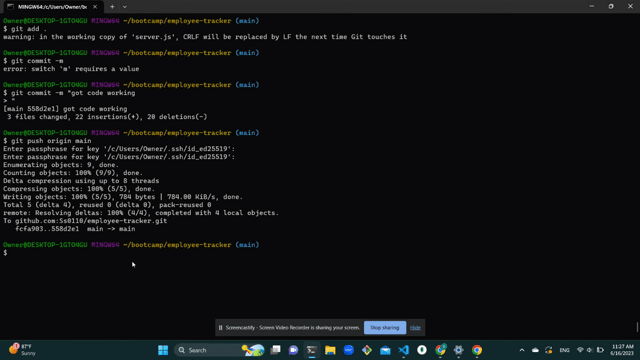

# Employee Tracker


## Description

The Employee Tracker is a command-line application built with Node.js, Inquirer, and MySQL that allows users to manage a company's employee database. With this application, business owners can view and manage departments, roles, and employees, enabling them to organize and plan their business effectively.



[Full Demo] https://youtu.be/9SFWRfqNZTc

## Table of Contents

- [Installation](#installation)
- [Usage](#usage)
- [License](#license)
- [Contributing](#contributing)
- [Questions](#questions)

## Installation

1. Clone the repository to your local machine.
2. Navigate to the project's root directory.
3. Install the required dependencies by running the following command:

   ```shell
   npm install
   ```

4. Set up the MySQL database by importing the provided schema and seed data files using a MySQL management tool such as MySQL Workbench.

5. Update the database connection configuration in the connection.js file to match your MySQL credentials:

```shell
const connection = mysql.createConnection({
host: 'localhost',
port: 3306,
user: 'your_mysql_username',
password: 'your_mysql_password',
database: 'employee_tracker_db',
});
```

## Usage

1. Start the application by running the following command:

```shell
 node server.js
```

2. Follow the prompts displayed in the command line to navigate through the available options:

- **View all departments:** Displays a formatted table showing department names and department IDs.
- **View all roles:** Displays a formatted table showing job titles, role IDs, the department each role belongs to, and the salary for each role.
- **View all employees:** Displays a formatted table showing employee data, including employee IDs, first names, last names, job titles, departments, salaries, and managers that the employees report to.
- **Add a department:** Prompts you to enter the name of the department and adds it to the database.
- **Add a role:** Prompts you to enter the name, salary, and department for the role and adds it to the database.
- **Add an employee:** Prompts you to enter the employee's first name, last name, role, and manager, and adds the employee to the database.
- **Update an employee role:** Prompts you to select an employee to update and their new role, and updates the information in the database.
- **Exit:** Exits the application.

3. Use the arrow keys to navigate the options and press Enter to select an option.

## License

This project is licensed under the MIT License.

## Questions

If you have any questions or need further assistance, please feel free to contact me:

GitHub Repository: https://github.com/Ss0110/employee-tracker

Email: saraysanchez01@yahoo.com
